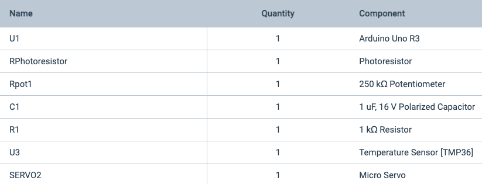
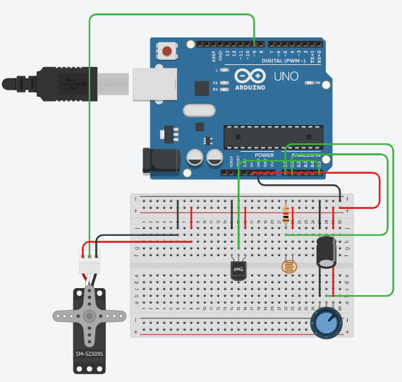

# Replication Instructions


## Requirements:
* [Arduino Starter Kit](https://search.arduino.cc/search/?tab=&q=starter+kit) or the Arduino components that can be found in the component's list below
* [Visual Studio Code](https://code.visualstudio.com/) or or any other code editor of your choice
* [Arduino software IDE](https://create.arduino.cc/editor) 
* [SerialPort NPM](https://www.npmjs.com/package/serialport)
* [Socket.io](https://socket.io/)
* [Node.js](https://nodejs.org/en/download/)

## Building the Circuit
You will need the following components for the Arduino circuit:


You will need to setup the following circuit for your Arduino:


## Arduino Code
Open up the Arduio IDE and add the following code:
```c++
// Servo Object
# include <Servo.h>
Servo myServo;
// Servo angle 
int angle;

// Potetiometer pin
int const potPin = A0;
// Potentiometer value
int potVal;

// Phototransistor pin
const int lightSensor = A1;
// Phototransistor value
int lightVal;

// Temperature pin
const int tempSensor = A5;
// Temperature value
int tempVal;
// Variables for converting temp from Celsius to Farenheit
float voltage;
float tempInC;
float tempInF;

// Potentiometer threshold
int threshold = 90; // set at 90 by default because it's in-between 0 and 180
// Temperature threshold
int tempThreshold = 90.0; // set at 90 degrees Farenheit by default
// Upper limit
int upperLimit = 180; // set at 180 by default because this is the max angle of the servo
// Lower limit
int lowerLimit = 0; // se at 0 by default bevause this is the min angle of the servo

// LEDs for debugging
int lightPin = 2;
int yellowLight = 7;
int greenLight = 3;

// Variable for controlling modes
int x = 0;


// setup() code runs once
void setup() {
  // Initialize serial monitor
  Serial.begin(9600);
  
  // Servo motor is attatched to pin 9
  myServo.attach(9);

  // All LEDs are outputs 
  pinMode(lightPin, OUTPUT);
  pinMode(yellowLight, OUTPUT);
  pinMode(greenLight, OUTPUT);
}


// Main code in loop() runs repeatedly:
// Code within this loop turns LEDs on and off for debugging and LEDs are not required for the program to run
void loop() {
  // Potentiometer Mode
  if(x == 0){
    // Send info to the webpage that potentiometer mode is selected
    Serial.println("Mode: Potentiometer");
    digitalWrite(lightPin, LOW);

    // Read the value of the potetiometer
    potVal = analogRead(potPin);

    // Scale the potentiometer's value and set the angle to it
    angle = map(potVal, 0, 1023, 0, 180);

    // Set servo to the angle
    myServo.write(angle);
    delay(15);

    // If angle of the servo is greater than the threshold
    if(angle >= threshold){
      // Send the webpage info that the blinds are open
      Serial.println("Open");
      digitalWrite(yellowLight, LOW);
      digitalWrite(greenLight, HIGH);
    }
    // Otherwise
    else if(angle < threshold){
      // Send the webpage info that the blinds are closed
      Serial.println("Closed"); 
      digitalWrite(yellowLight, HIGH);
      digitalWrite(greenLight, LOW);
    }
  }
  
  // Phototransistor Mode
  else if(x == 1){
    // Send info to the webpage that phototransistor mode is selected
    Serial.println("Mode: Phototransistor");
    digitalWrite(lightPin, HIGH);

    // Read the value from the phototransistor
    lightVal = analogRead(lightSensor);
    
    // If the light value is greater than 600 (default threshold for sensing light)
    if(lightVal > 600){
       // Move the servo to the upper limit and 
       // send the webpage info that the blinds are open
       myServo.write(upperLimit);
       Serial.println(upperLimit);
       Serial.println("Open"); 
       digitalWrite(yellowLight, LOW);
       digitalWrite(greenLight, HIGH);
     }
     // Otherwise
     else{
       // Move the servo to the lower limit and 
       // send the webpage info that the blinds are closed
       myServo.write(lowerLimit);
       Serial.println(lowerLimit);
       Serial.println("Closed"); 
       digitalWrite(yellowLight, HIGH);
       digitalWrite(greenLight, LOW);
     }

     delay(1000);
  }
  
  // Temperature Mode
  else if(x == 2){
    // Send info to the webpage that the temperature mode is selected
    Serial.println("Mode: Temperature");
    digitalWrite(lightPin, LOW);

    // Calculate the value of the temperature from the temp sensor
    // and convert it to Farenheit
    tempVal = analogRead(tempSensor);
    voltage = (tempVal / 1024.0) * 5.0;
    tempInC = (voltage - .5) * 100;
    tempInF = (tempInC * 1.8) + 32;
    Serial.println(tempInF);

    // If the temperature is greater than the temperatur threshold
    if(tempInF >= tempThreshold){
      // Move the servo to the lower limit and 
      // send the webpage info that the blinds are closed
      myServo.write(lowerLimit);
      Serial.println(lowerLimit);
      Serial.println("Closed"); 
      digitalWrite(yellowLight, HIGH);
      digitalWrite(greenLight, LOW);
    }
    else{
      // Move the servo to the upper limit and 
      // send the webpage info that the blinds are open
      myServo.write(upperLimit);
      Serial.println(upperLimit);
      Serial.println("Open"); 
      digitalWrite(yellowLight, LOW);
      digitalWrite(greenLight, HIGH);
    }

    delay(1000);  
  }

  // Temperature or Phototransistor Mode
  else if(x == 3){
    Serial.println("Mode: Temperature or Light");
    
    // Calculate the value of the temperature from the temp sensor
    // and convert it to Farenheit
    tempVal = analogRead(tempSensor);
    voltage = (tempVal / 1024.0) * 5.0;
    tempInC = (voltage - .5) * 100;
    tempInF = (tempInC * 1.8) + 32;
    Serial.println(tempInF);

    // Get the light value from the phototransistor
    lightVal = analogRead(lightSensor);

    // If the temperature is above the temperature threshold or the light is below the threshold
    if(tempInF >= tempThreshold || lightVal < 600){
       // Move the servo to the lower limit and 
       // send the webpage info that the blinds are closed
       myServo.write(lowerLimit);
       Serial.println(lowerLimit);
       Serial.println("Closed"); 

       digitalWrite(yellowLight, HIGH);
       digitalWrite(greenLight, LOW);
     }
     // Otherwise
     else{
      // Move the servo to the upper limit and 
      // send the webpage info that the blinds are open
      myServo.write(upperLimit);
      Serial.println(upperLimit);
      Serial.println("Open"); 

      digitalWrite(yellowLight, LOW);
      digitalWrite(greenLight, HIGH);
    }

    delay(1000);
  }

  // Temperature and Phototransistor Mode
  else if(x == 4){
    Serial.println("Mode: Temperature and Light");
    
    // Calculate the value of the temperature from the temp sensor
    // and convert it to Farenheit
    tempVal = analogRead(tempSensor);
    voltage = (tempVal / 1024.0) * 5.0;
    tempInC = (voltage - .5) * 100;
    tempInF = (tempInC * 1.8) + 32;
    Serial.println(tempInF);

    // Get the light value from the phototransistor
    lightVal = analogRead(lightSensor);

    // If the temperature is greater than or equal to the temperature threshold and there is no light
    if(tempInF >= tempThreshold && lightVal < 600){
       // Move the servo to the lower limit and 
       // send the webpage info that the blinds are closed
       myServo.write(lowerLimit);
       Serial.println(lowerLimit);
       Serial.println("Closed"); 

       digitalWrite(yellowLight, HIGH);
       digitalWrite(greenLight, LOW);
     }
     else{
      // Move the servo to the upper limit and 
      // send the webpage info that the blinds are open
      myServo.write(upperLimit);
      Serial.println(upperLimit);
      Serial.println("Open"); 

      digitalWrite(yellowLight, LOW);
      digitalWrite(greenLight, HIGH);
    }

    delay(1000);
  }

  // Open blinds
  else if(x == 5){
    Serial.println("Mode: Open");

    // Move the servo to the upper limit and 
    // send the webpage info that the blinds are open
    myServo.write(upperLimit);
    Serial.println("Open");

    digitalWrite(yellowLight, LOW);
    digitalWrite(greenLight, HIGH);

    delay(1000);
  }

  // Close blinds 
  else if(x == 6){
    Serial.println("Mode: Close");

    // Move the servo to the lower limit and 
    // send the webpage info that the blinds are closed
    myServo.write(lowerLimit);
    Serial.println("Closed"); // Comment out in order to be able to be able to debug

    digitalWrite(yellowLight, HIGH);
    digitalWrite(greenLight, LOW);
    
    delay(1000);
  }
  

  // Check to make sure Arduino is receiving information over serial port
  if(Serial.available() > 0){
    String receivedString = "";

    // Loop that constantly reads information that is sent from the webapp through the serialport
    // and puts it into receivedString variable 
    while(Serial.available() > 0){
      receivedString += char(Serial.read());
    }

    // User selects "Potentiometer Mode"
    if(receivedString == "0"){
      // Set mode to "Potentiometer Mode"
      x = 0;
    }

    // User selects "Phototransistor Mode"
    else if (receivedString == "1"){
      // Set mode to "Phototransistor Mode"
      x = 1;
    }

    // User selects "Temperature Mode"
    else if(receivedString == "2"){
      // Set mode to "Temperature Mode"
      x = 2;
    }

    // User selects "Temperature or Phototransistor" mode
    else if(receivedString == "3"){
      // Set mode to "Temperature or Phototransistor"
      x = 3;
    }

    // User selects "Temperature and Phototransistor" mode
    else if(receivedString == "4"){
      // Set mode to "Temperature and Phototransistor"
      x = 4;
    }

    // User clicks "Open" button
    else if(receivedString == "5"){
      // Open blinds 
      x = 5;
    }
    
    // User clicks "Close" button 
    else if(receivedString == "6"){
      // Close blinds
      x = 6;
    }

    // User sets potentiometer threshold
    else if(receivedString.substring(0, 1) == "P"){
      // Change potentiometer threshold to the value in the input box
      threshold = receivedString.substring(2, 4).toInt();
    }

    // User sets temperature threshold
    else if(receivedString.substring(0, 1) == "T"){
      // Change temperature threshold to value in the input box 
      tempThreshold = receivedString.substring(2, 4).toInt();
    }

    // User sets upper limit 
    else if(receivedString.substring(0, 1) == "U"){
       // Change upper limit to value in the input box
       upperLimit = receivedString.substring(2, 5).toInt();
    }

    // User sets lower limit 
    else if(receivedString.substring(0, 1) == "L") {
       // Change lower limit to value in the input box
       lowerLimit = receivedString.substring(2, 4).toInt();
    }
  }
}
```

After adding the code, follow these steps to run it:
1. Connect the Arduino board to your computer using a USB cable.
2. You need to know the name of the serialport your Arduino is attached to. You can find the name of your serialport. It will look something like `/dev/tty.wchusbserialfa1410`. On a Mac using the Terminal and entering the following command:```ls /dev/{tty,cu}.*``` On a PC you can use the command line and the following command:```chgport```
3. In the Arduino IDE go to `Tools > Board` and select the serial port that your Arduino is connected to.
4. To upload the code, press the `UPLOAD` toggle on the top left corner of the IDE, which is an arrow pointing to the right.

## Webpage Code
Open VSCode or your desired code editor and create an HTML file called `index.html`. Add the following code:
```javascript
<!doctype html>
<html>
   <head>
      <title>Communicating from Node.js to an Arduino</title>
      <script src='https://cdnjs.cloudflare.com/ajax/libs/socket.io/2.0.4/socket.io.js'></script>
   </head>
   <body>

      <h1 id="title">Smart Blinds</h1>

      <!-- Status heading -->
      <h3 id="statusHeading">Status</h3>

      <!-- Status indicators -->
      <div>
         <p id="mode">Mode: Select a mode</p> 
         <p id="status"></p>
      </div>
      </br>

      <!-- Quick functions heading-->
      <h3 id="quickFunctionsHeading">Quick Functions</h3>
      <div>
         <button id="openBlinds" onclick="openBlinds()">Open blinds</button>
         <button id="closeBlinds" onclick="closeBlinds()">Close blinds</button>
      </div>
      </br>

      <!-- Modes heading -->
      <h3 id="modesHeading">Modes</h3>

      <!-- Buttons for the different modes  -->
      <div>
         <button id="dial" onclick="potentiometer()">Potentiometer Mode</button>
         <button id="light" onclick="phototransistor()">Phototransistor Mode</button>
         <button id="temp" onclick="temperature()">Temperature Mode</button>
         <button id="tempOrLight" onclick="tempOrLight()">Temperature or Phototransistor</button>
         <button id="tempAndLight" onclick="tempAndLight()">Temperature and Phototransistor</button>
      </div>
      </br>
      
       
      <!-- Settings heading -->
      <h3 id="settingsHeading">Settings</h3>

      <!-- Adjust settings for the potentiometer -->
      <div>
         <input id="input-text" type="text" placeholder="10-60" maxlength="32">
         <input id="send-text" type="submit" value="Set potentiometer threshold">
      </div>

      <!-- Adjust settings for the temperature -->
      </br>
      <div>
         <input id="input-temp" type="text" placeholder="10-130" maxlength="32">
         <input id="send-temp" type="submit" value="Set temperature (Farenheit) threshold"> 
      </div>

      <!-- Adjust settings for the upper limit -->
      </br>
      <div>
         <input id="input-upper" type="text" placeholder="100-180" maxlength="32">
         <input id="send-upper" type="submit" value="Set upper limit">
      </div>

      <!-- Adjust settings for lower limit -->
      </br>
      <div>
         <input id="input-lower" type="text" placeholder="0-99" maxlength="32">
         <input id="send-lower" type="submit" value="Set lower limit">
      </div>

      <script>
         // Initializing socket variable
         var socket = io();

         // Logging all data gathered from socket to change status of blinds
         socket.on('data', function(data){
            console.log(data);

            // If the data is "Closed"
            if(data == "Closed"){
                // Set the blind status to "Closed"
               document.getElementById("status").innerHTML = "Status: Closed";
            }
            // Otherwise is if the data is "Open"
            else if(data == "Open"){
                // Set th eblind status to "Open"
               document.getElementById("status").innerHTML = "Status: Open";
            }
         });

         // When potentiometer is clicked
         function potentiometer(){
            document.getElementById("mode").innerHTML = "Mode: Potentiometer";
            socket.emit('modeSelector', { "status":"0" });
         }

         // When phototransistor is clicked
         function phototransistor(){
            document.getElementById("mode").innerHTML = "Mode: Phototrasistor";
            socket.emit('modeSelector', { "status":"1" });
         }

         // When temperature is clicked
         function temperature(){
            document.getElementById("mode").innerHTML = "Mode: Temperature";
            socket.emit('modeSelector', {"status":"2"});
         }

         // When teperature or photransistor is clicked
         function tempOrLight(){
            document.getElementById("mode").innerHTML = "Mode: Temperature or Light";
            socket.emit('modeSelector', {"status":"3"});
         }

         // When temperature and phototransistor is clicked
         function tempAndLight(){
            document.getElementById("mode").innerHTML = "Mode: Temperature and Light";
            socket.emit('modeSelector', {"status":"4"});
         }

         // When open blinds is clicked
         function openBlinds(){
            
            socket.emit('modeSelector', {"status":"5"});
         }

         // When close blinds is clicked
         function closeBlinds(){
            
            socket.emit('modeSelector', {"status":"6"});
         }

         // Setting the potentiometer threshold
         var sendTextButton = document.getElementById("send-text");

         sendTextButton.addEventListener("click", function(){
            var sendText = document.getElementById("input-text").value;
            socket.emit('input-text', sendText)
         });

         // Setting the temperature threshold
         var sendTempButton = document.getElementById("send-temp");

         sendTempButton.addEventListener("click", function(){
            var sendTemp = document.getElementById("input-temp").value;
            socket.emit('input-temp', sendTemp)
         });

         // Setting the upper limit
         var sendUpperButton = document.getElementById("send-upper");

         sendUpperButton.addEventListener("click", function(){
            var sendUpper = document.getElementById("input-upper").value;
            socket.emit('input-upper', sendUpper)
         });

         // Setting the lower limit
         var sendLowerButton = document.getElementById("send-lower");

         sendLowerButton.addEventListener("click", function(){
            var sendLower = document.getElementById("input-lower").value;
            socket.emit('input-lower', sendLower)
         });

      </script>


      <style>
         *{
            background-color: black;
         }

         #title{
            color:white;
         }
         
         #light, #dial, #temp, #tempOrLight, #tempAndLight, #openBlinds, #closeBlinds{
            background-color:rgb(255, 255, 255);
            color:rgb(82, 82, 82);
            border-radius:5px;
            border-color:gray;
         }

         #mode, #status, #quickFunctionsHeading, #statusHeading, #modesHeading, #settingsHeading, #input-text, #send-text, #input-temp, #send-temp, #input-upper, #send-upper, #input-lower, #send-lower{
            color:white;
         }
      </style>

   </body>
</html>
```

## Node.js Server
Create a file called `index.js` and add the following code:
> Note: Make sure to replace `'/dev/tty.usbmodem14101'` with your own serialport location that you previously found when you uploaded your Arduino code.
```javascript
// Start the server using http library and file system library to grab the index page
var http = require('http');
var fs = require('fs');
var index = fs.readFileSync( 'index.html');

// Load serialport library into SerialPort variable
var SerialPort = require('serialport');

// Parser is created and tells Node.js to receive data coming in through serialport, reading each line
const parsers = SerialPort.parsers;
const parser = new parsers.Readline({
    delimiter: '\r\n'
});

// Port has to be opened up with the location of the port connected to the Arduino passed in as an argument.
// This argument passed in on the line below '/dev..' will need to be substituted with your own port address
// Connect Arduino to computer and use the command ls /dev/{tty,cu}.* in comand line to find your port address
var port = new SerialPort('/dev/tty.usbmodem14101',{
    baudRate: 9600,
    dataBits: 8,
    parity: 'none',
    stopBits: 1,
    flowControl: false
});

// Attatch port to parser object
port.pipe(parser);

// Server named 'app' is craeted and it will return the contents of the index.html file.
var app = http.createServer(function(req, res) {
    res.writeHead(200, {'Content-Type': 'text/html'});
    res.end(index);
});

// Socket has to be initialized, which will send the information from the Node.js server to the webpage.
var io = require('socket.io').listen(app);

// Connection event is executed
// When a button is clicked on a webpage one of the functions inside this event
// will send data to the Arduino to be read
io.on('connection', function(socket) {
    // Inidcate that Node is using port upon connection
    console.log('Node is listening to port');
    
    // Function for sending selected mode 
    socket.on('modeSelector',function(data){
        console.log( data );
        port.write( data.status );
    });

    // Function for sending potentiometer threshold
    socket.on('input-text', function(data){
        port.write('P ' + data);
        console.log('P ' + data);
    });

    // Function for sending temperature threshold
    socket.on('input-temp', function(data){
        port.write('T ' + data);
        console.log('T ' + data);
    });

    // Function for sending upper limit
    socket.on('input-upper', function(data){
        port.write('U ' + data);
        console.log('U ' + data);
    });
    
    // Function for sending lower limit
    socket.on('input-lower', function(data){
        port.write('L ' + data);
        console.log('L ' + data);
    });
});

// Parser is given an on event whenever data is received
// When the parser receives data, it will run the function below and this data will be console logged. 
//Additionally, when data is received from the parser, which is data coming from the serialport, a message should be emitted. 
// That message will be called ‘data’ and the data that will be passed will be the data variable.
parser.on('data', function(data){
    console.log('Received data from port: ' + data);

    io.emit('data', data);
})

app.listen(3000);


```


## Installing packages using npm
1. Open a console window and navigate to the folder you are using for the project.
2. At the console prompt type `npm init`.
4. Change the default answers or press enter to accept them. Keep the default entry point as index.js.
5. Open up the project folder in a code editor. Open the root folder for the application, as you want to be able to see all the files and folders connected to the project. at the moment there you should see a file package.json. This is where you will see all the packages being installed. 
6. Open the console window and type `npm install socket.io@1.7.3 -save` to install socket.io
7. If you have a Mac: In the console window type `npm install serialport@9.0.1 --save` to install serialport
8. If you have a PC: In the command line type `npm install serialport@9.0.1 --build-from-source` to install serialport
9. If you look at your package.json file you should be able to see the dependencies are updated with the versions of socket.io and serialport that you installed.

> Note: These dependencies are written by different people and are updated at different times. These updates can break your code. Semantic versioning is used to track the changes. This means that each number of a version number has a particular meaning. The version number is made up of three numbers separated with a full stop. The numbers increase with each new version and each number represents a different kind of update. If you install the versions of socket.io and serialport described here and you receive messages that the code is depricated, you may need to use the most updated versions. You can do this by adding `*` at the end when you use npm install. For example: `npm install socket.io@*`

## Launching the application
1. Open your Arduino IDE and upload the code to your Arduino using the right arrow at the top left corner.
2. Using the Terminal start your Node.js server using `node index.js`.
3. Open up a browser and enter the URL `http://localhost:3000/`.
4. The robot and webpage are now in communication and the project is running.


